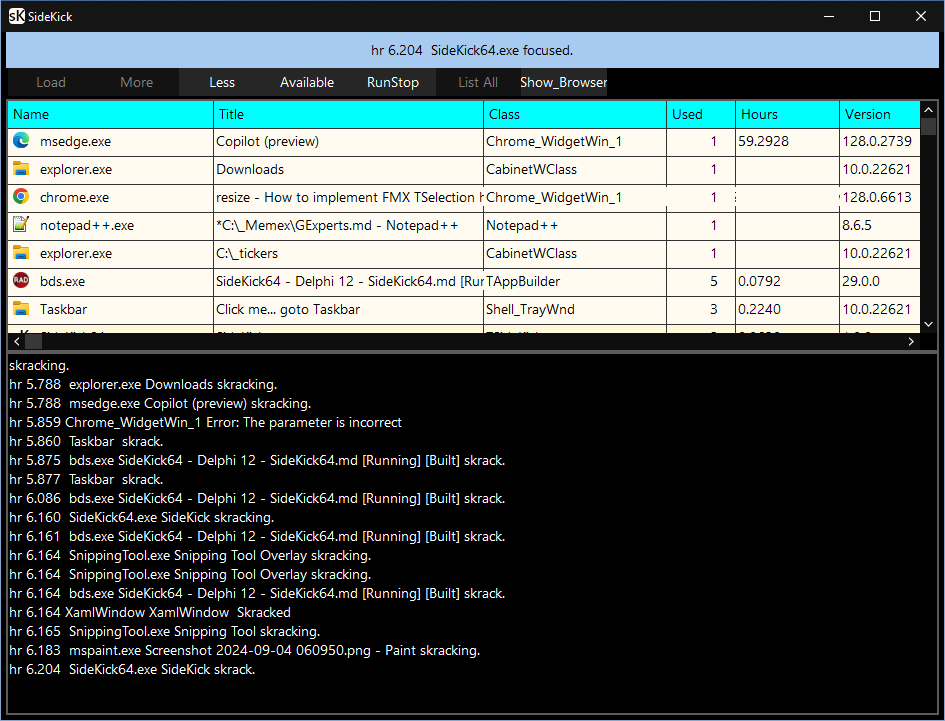

SideKick64
===========
Quick navigation of programs running

Reminiscent of Windows 3 Program Manager or old DOS programs like Borland's SideKick or Radio Shacks Desktop

This sidekick directive is to collect and use the data availiable on local machine.




#Shows All Apps Running

Click on a row to show App in it's Desktop(1).

Clicking on a App listed in the grid moves to that Desktop regardless of the Desktop(1)!

Records when bad Windows when they poop out an error.

##Using SideKick64
Launch and surface SK from IDE or Notepad++

Add a return to SideKick64 app with configure __T__ools under the Tools menu
Just browse for the SideKick.exe to set this up also Notepad++ in the Run menu has similar feature.


##AppList Simply explained

AppList Updates the UI through timer events
The UI can ChangeState Running Stopped gatherwindows

Hourage Time is reckoned by hour meter rounded to 3 demical places.

GoodApps array of the Executables Classnames we want to track and navigate to.

Records GetLastWinError
 Chrome_WidgetWin_1 err:Access is denied

Compiling as 64 allows the icons and version numbers of 64bit windows. Also Windows like Copilot and TApplication show up when the more button is pressed.  The Less can weed out the extra window.

My favorite is the shell task shows the task bar to see the time.  The battery is flat on my garden shed clock.


 NotePad++ shows Microsoft __ZWSP__ Edge when showing symbols blah!
   fix Tencoding setting to UTF8 for TFile to save

(1.) Actually switches to the taskbar that shows that taskbar's apps and the apps opened in it's "Desktop".

Copyright (c) 2024 Patrick Foley

The code engine.
```
type // 0        1     2        3            4           5       6
  TskState = (skStartPoint, skRun, skStop, skRunStop, skEverythingTrue,
    skEverythingFalse, skEnumWindows, skOpen, skSave, skEndPoint);

  TaskStates = TArray<TskState>;
  TpatProc = procedure of object;
  TmyProc = TProc;
  TaskCommands = TList<TpatProc>;
  TWinHandles = TList<NativeInt>; // was Unsigned
  TpatAM = reference to procedure;

  ptrWin = ^TWin;

  TWin = record
    Handle: HWnd;
    ClassName: string;
    Name: string;
    sVersion: string;
    Title: string;

    Hours: string;
    Job: Char; // 'A'..'Z';
    // Kind: string;
    // TKindIndex;//'A'..'Z' ;//string;  //  used with      InsertionPoint,
    // sgRow: Integer;
    // Used = Inc on load and focused

    // Task: procedure of object;
    // TpatProc = procedure of object;
    // TmyProc = TProc;

    // Task: TFunc<Boolean>;//TProc;TmyProc;
    // fixup: procedure of object;
    // Task: TFunc<ptrWin, Boolean>;
    Task: TProc<ptrWin>;
    // Task: Procedure of Object;
    // Task: Tfunc<Boolean>;
    // TpatAM: reference to procedure;//Procedure of object;            TProc;
    Used, MarkTick, AcculmTick: Uint64;
    Icon: TIcon;
  end;
  ```
